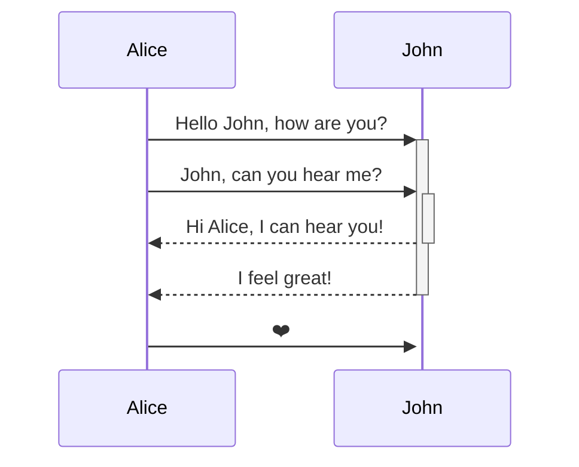
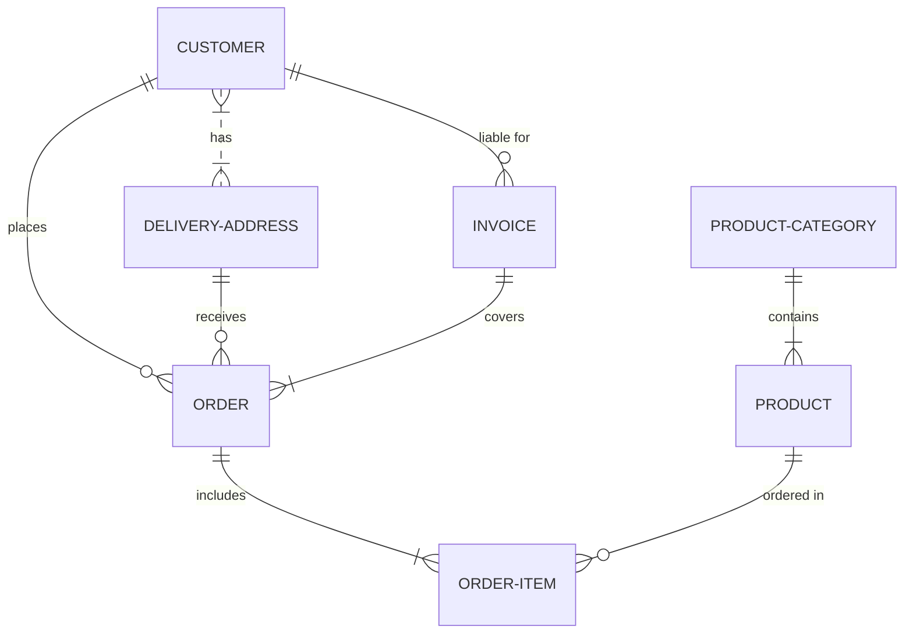
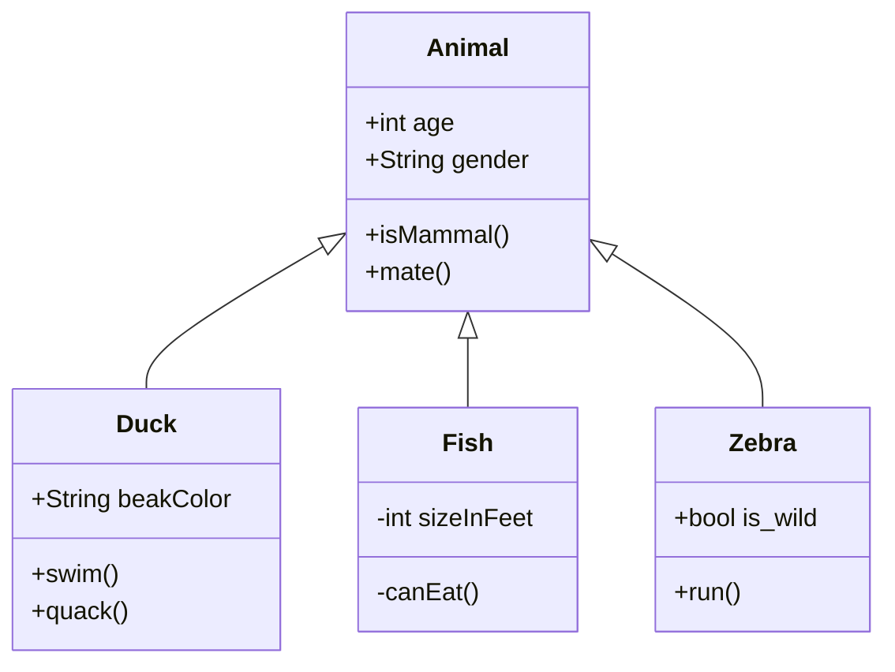

# Architecture

## Intro

This file describes the project architecture, like classes, database models, etc. If you need to create any diagram, use [Mermeid live editor](https://mermaid-js.github.io/mermaid-live-editor/#/edit/eyJjb2RlIjoic2VxdWVuY2VEaWFncmFtXG4gICAgQWxpY2UtPj4rSm9objogSGVsbG8gSm9obiwgaG93IGFyZSB5b3U_XG4gICAgQWxpY2UtPj4rSm9objogSm9obiwgY2FuIHlvdSBoZWFyIG1lP1xuICAgIEpvaG4tLT4-LUFsaWNlOiBIaSBBbGljZSwgSSBjYW4gaGVhciB5b3UhXG4gICAgSm9obi0tPj4tQWxpY2U6IEkgZmVlbCBncmVhdCFcbiAgICBBbGljZS0-PitKb2huOiDinaTvuI9cbiAgICBcbiAgICAgICAgICAgICIsIm1lcm1haWQiOnsidGhlbWUiOiJkZWZhdWx0In0sInVwZGF0ZUVkaXRvciI6ZmFsc2V9), which is free and open-source. Just copy its markups and paste it on here surrounded by ` ```mermaid ` and ` ``` `.

### Sequence diagram



### ER diagram



### Class diagram


